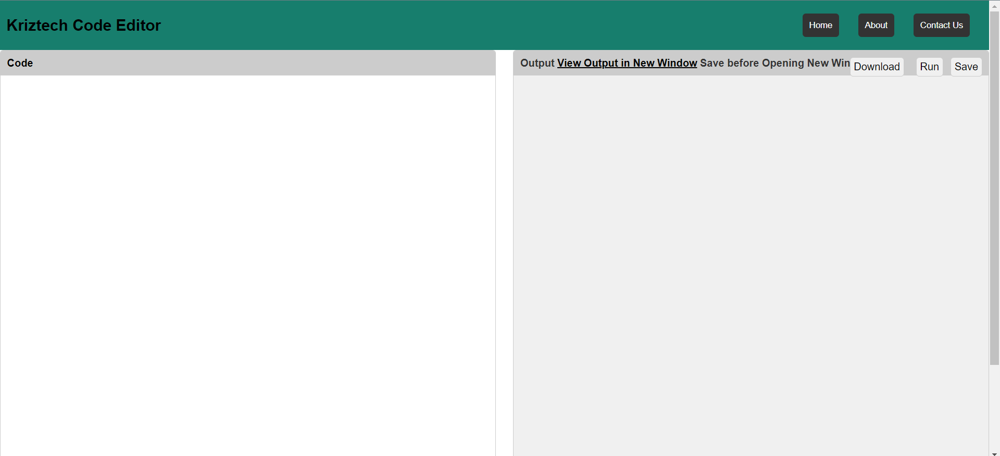
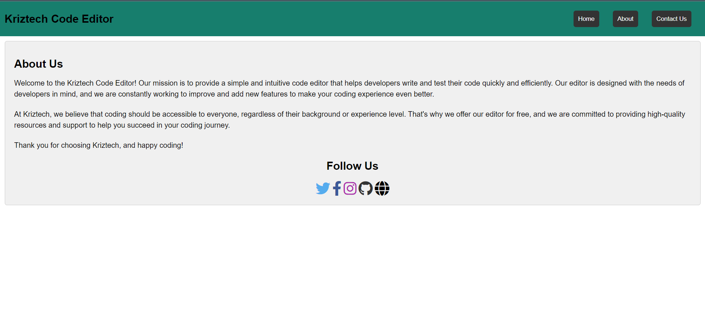
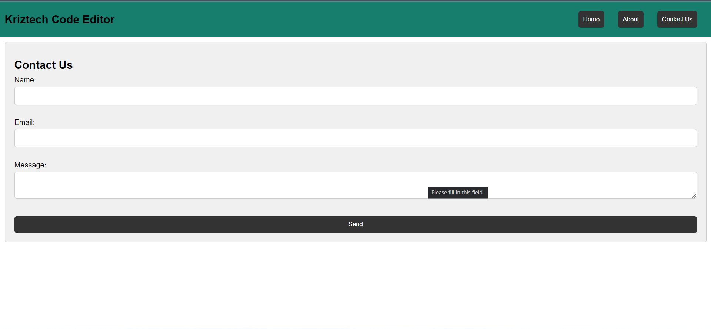

<h1 align="center">Welcome to Kriztech Code Editor  👋</h1>  

## HTML Editor
This is a simple HTML editor. You can edit your HTML code and save it to a file. You can also load a file and edit it
## Features
* [x] Live preview
* [x] User Friendly
* [x] Code Download
* [x] New Window Open for Code Preview
* [x] Contact Us for Suggestions

## Screenshot 




## Installation
* Clone Project on Github
```
git clone https://github.com/altkriz/htmleditor.git
```
## Usage
```javascript
var editor = new HTMLEditor();
editor.render();
```
<h1>Author</h1> : <h2>Kashif Raza</h2> 

## Show your support
Give a ⭐️ if this project helped you!

***
