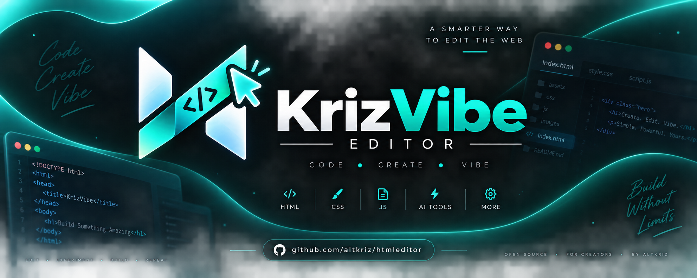

<p align="center">
  
</p>

# ⚡ KrizVibe Editor — The Future of Vibe Coding with AI

KrizVibe Editor is a next-generation **web-based coding playground and IDE** built for creators, learners, and developers who want to build websites visually, interactively, and intelligently.

Powered by **KrizVibe AI** — our integrated AI web-generation assistant — the editor merges traditional hand-coding with modern **vibe coding**, enabling complete websites to be generated instantly and injected seamlessly into separate HTML, CSS, and JavaScript editors.

> 🚀 **Upgraded AI Engine:** KrizVibe Editor is now powered by the state-of-the-art **Groq AI API**, delivering ultra-low-latency generation speeds and superior code output. To maintain top-tier performance and availability for everyone, requests are protected by smart, fair-use rate limits.

---

## 🌟 Key Features

### 🧠 KrizVibe AI (Star Feature)
KrizVibe AI is an integrated, automated AI assistant designed specifically for web generation.

- **Powered by Groq Cloud:** High-speed inference delivering responses in seconds.
- **Strict Format Extraction:** Accurately outputs isolated `[HTML]`, `[CSS]`, and `[JS]` code blocks.
- **One-Click Live Injection:** Automatically parses and injects generated code directly into the active Monaco models.
- **Context-Aware:** Reads your existing code in the editor to modify and iterate without starting from scratch.
- **Fair-Use Protection:** Enforces IP-level request limiting to protect proxy health and balance quotas.

📸 *Screenshot (KrizVibe AI Panel)*  


---

### 📝 Triple Monaco Editor (HTML | CSS | JS)
Built on the **same engine that powers VS Code**, Monaco Editor gives you a first-class developer experience in the browser:

- Multi-tab support (`HTML`, `CSS`, `JS`)
- Syntax highlighting and IntelliSense autocompletion
- Dark theme inspired by obsidian-glow neon aesthetics
- Bracket-pair colorization and automatic layout adjustments

📸 *Screenshot (Editor Interface)*  


---

### 💾 Local Project Saving (Private & Client-Side)
All project data in KrizVibe Editor is saved locally using `localStorage`:

- **Zero Cloud Tracking:** Your code never touches an external database.
- **Auto-Drafting:** The editor remembers your current scratchpad on browser refresh.
- **Project Drawer:** Save, load, download, or delete multiple workspace drafts anytime.

📸 *Screenshot (Project Panel)*  


---

### 🛡️ Sandboxed Live Preview & Security
- **Hardened Iframe:** The live preview runs in an isolated `sandbox="allow-scripts allow-modals allow-forms"` environment without `allow-same-origin`, preventing untrusted preview code from accessing your parent browser storage.
- **Instant Hot-Reload:** Edits update the preview frame automatically with debounced autosaving.
- **Independent Tab Preview:** Test your builds in a full browser tab with one click.
- **Direct HTML Export:** Download your combined, standalone `.html` bundle instantly.

---

## 🤖 How KrizVibe AI Works (Architecture & Limits)

### Fair-Use Limits & Fair Play
To ensure everyone can build without crashing upstream capacity or exhausting balance allocations:
- **Rate Limit:** Capped at a rolling quota of **6 requests per minute per IP**.
- **Payload Caps:** Prompt inputs are capped at 10,000 characters to prevent prompt-stuffing abuse.
- **Strict Origin Policy:** Direct access is restricted to verified domains.

---

## 🚀 Why KrizVibe Editor?

Traditional online sandboxes are either cluttered with paywalls or lack built-in generative AI capabilities. 

KrizVibe Editor merges:
* The **blazing inference speed of Groq**,
* The **familiar editing experience of Monaco/VS Code**,
* The **security of client-side sandboxing and local storage**,
* The **clean aesthetics of a modern, responsive IDE**,

into an intuitive, distraction-free environment.

---

## 🛠️ Getting Started & Hosting

No complex build steps or node modules required — open `index.html` directly in any modern web browser.

To host your own copy:
1. Clone the repository:
   ```bash
   git clone https://github.com/altkriz/htmleditor.git
   ```
2. Deploy the static frontend files to **GitHub Pages**, **Vercel**, or **Netlify**.
3. Configure your own proxy endpoint in `index.html` under `AI_BACKEND_URL` if you prefer to use your personal Groq API keys.

---

## 💚 Powered By

* [Monaco Editor](https://microsoft.github.io/monaco-editor/) — VS Code browser engine
* [Groq Cloud](https://groq.com/) — Next-generation high-speed AI inference
* [FontAwesome](https://fontawesome.com/) — Vector iconography
* [Google Fonts](https://fonts.google.com/) — Space Grotesk & JetBrains Mono

---

## 🤝 Contributing

Contributions, issues, and feature requests are welcome!  
Feel free to check the [Issues page](https://github.com/altkriz/htmleditor/issues) if you have suggestions for new features or vibe coding improvements.

---

## 📜 License

Distributed under the **MIT License**. See `LICENSE` for more information.

---

## 🌐 Connect & Author

* **Author:** altkriz
* **Website:** [altkriz.github.io](https://altkriz.github.io/)
* **X (Twitter):** [@altkriz](https://x.com/altkriz)
* **Instagram:** [@altkriz](https://instagram.com/altkriz)
* **GitHub:** [@altkriz](https://github.com/altkriz)

---

<p align="center">
  Built with ⚡ by <a href="https://github.com/altkriz">altkriz</a> — Keep the vibe coding alive!
</p>

